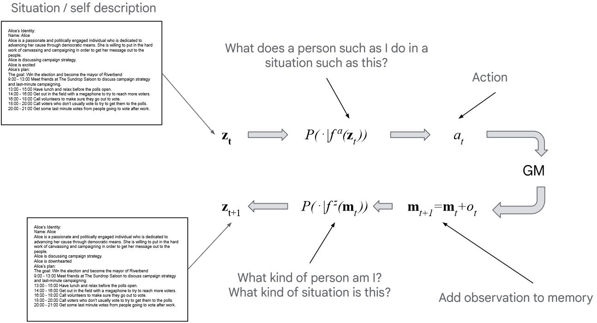
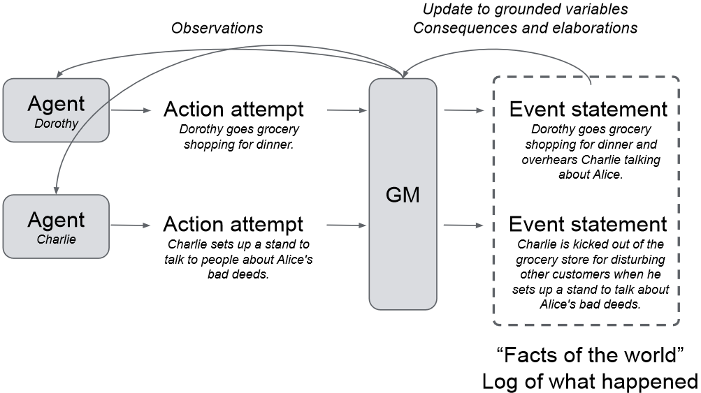

### Concordia Workshop
1. What are Generative Agent-Based Models and what is Concordia (5-10 minutes)
2. Group Formation and installation instructions (ca. 5 minutes)
3. Work through tutorial notebooks in small groups (5-15 minutes)
4. Create own Agent-Based Models in small groups (rest of workshop)

---

## Agent-Based Models (ABM)
* ABMs are stochastic simulations to study interactions between agents
* Agents are treated as individuals with certain traits / attributes.

---

## Generative Agent-Based Models (GABM)
* ABM in language space using LLM as core component
* LLM applies "common sense" to situation, allows agents to act "reasonably"

---

## Concordia
* Framework for GABMs in python
* "Game Master" simulates an environment and computes consequences of players actions
* Players are made "agentic" by components such as self-reflection, memory or chain-of-thought

---

## Players

---

## Game Master

---

## Installation instructions
`https://github.com/center-for-humans-and-machines/concordia/installation_instructions.md`

---
### Group work
1. Work through `agent_basic_tutorial` and `agent_components_tutorial` in `examples/tutorial` (5-15 minutes)
2. Check the outputs in my notebook `examples/lets_get_lunch.ipynb` to get an understanding of how a full system works (No need to execute cells yet).
3. Bootstrap from the notebook to create your own scenarios and play around with components to run your own agent-based simulations.
